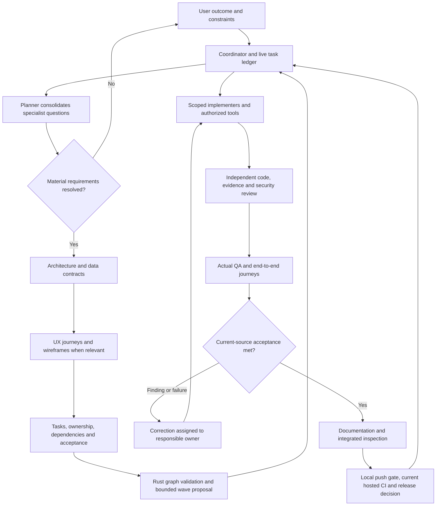

# Agent architecture and professional delivery flow

The active host coordinator owns requirements, scope, task planning, integration
and release decisions. It routes real native agents to relevant skills and connected
tools. The Rust kernel validates reported records and proposes bounded work; the
host owns execution, identity checks and authority. This is a centralized manager
with hierarchical scoped delegation, adapted to each project's platform and language.

## Role and capability mapping

Fourteen optional profiles are in `assets/codex-agent-profiles`; see the
[project planner profile](../assets/codex-agent-profiles/project_planner.toml) as an example.
Use actual callable host roles or scoped native fallbacks. Profile files alone do
not establish availability. The coordinator owns user questions and goal/checklist
updates; a separate agent is unnecessary merely to tick a task.

| Responsibility | Existing role | Skills/tools | Required output/gate |
| --- | --- | --- | --- |
| Questions and requirements | project_planner | project-discovery; capability inventory | Confirmed scope, material unknowns and acceptance criteria |
| Source exploration | evidence_explorer | Native file/search tools; primary docs | File/symbol evidence and uncertainty |
| Architecture/API/data | solution_architect | project-design; verified stack/database tools | Contracts, trust boundaries and confirmed decisions |
| UX and visual planning | ux_planner | project-design; reviewed UI UX Pro Max; connected design tools | Journeys, pages/sections/layout, wireframes and accessibility criteria |
| Capability research | capability_researcher | capability-manager; plugin-safety-review | Pinned source/license, reuse options, cost, permissions and test plan |
| Frontend/backend/database code | scoped_implementer | Relevant coding/data skills and authorized tools | Owned changes, observable behavior and actual checks |
| Correctness review | verification_reviewer | Actual source/diff/artifacts | Independent findings and regression assessment |
| Evidence review | evidence_reviewer | project-evidence-review; primary API sources | Challenge invented results/APIs, harmful hardcoding and fake production behavior |
| Security | security_auditor | project-security; scoped advisory evidence | Confirmed findings, fixes and verification |
| QA/E2E | qa_executor | project-qa; actual CLI/browser/native tests | Exact-source positive/negative journeys and truthful outcomes |
| Documentation | documentation_maintainer | project-documentation | Current narrative docs; required entry files remain in place |
| CI/CD and release | release_engineer | project-release; actual GitHub/delivery tools | Local E2E before feature push; current hosted CI before merge |
| PR gate | pr_auditor | Actual head, diff, checks and rules | Current revision, independent review and release evidence |
| Business/legal/finance | business_analyst | business-operations; approved records/calculations | Jurisdiction/date/currency/scope, sources and reproducible calculations |

Frontend/backend/database specialists can be separate implementer instances with
disjoint ownership. A Flutter screen, Rust service and SQL migration receive different
tools and criteria. No universal stack, database, provider or UI template is assumed.
For business work, domain prompts do not establish professional certification or
permission for payments, emails or legal filings.

## Questions, assignments and evidence

The planner asks small, prioritized batches. Specialists send candidate questions
to the coordinator, which consolidates them and reuses confirmed answers. Resolve
users/outcome/non-goals, platform/language, applicable pages and flows, integrations,
data, identity, sensitive-data handling, budget and test environment. Record unresolved
decisions explicitly: independent research can continue, but dependent tasks wait.
For an existing narrow fix, ask only missing questions that change behavior or risk.

Each assignment identifies requirement/task ID, project root, current source revision,
objective, dependencies, callable capabilities, permitted actions, read/write ownership,
acceptance and expected evidence. Workers share the codebase and preserve others' edits.
Serialize write/write and read/write conflicts; respect live concurrency and keep
review capacity. Documentation edits to shared files also need ownership coordination.

Results identify actual artifacts, commands/checks, source revision, failures, findings,
unresolved inputs and next recommendation. The coordinator inspects the diff, file,
preview, log or receipt before acceptance. Agent completion messages are review inputs.
Native messages issue scoped corrections; conflicts and ownership changes return to
the coordinator. Separate user-owned chats require explicit messaging authorization.

## MCP, skills and external A2A

Discover actual host catalogs/schemas. Track researched, created, installed, discovered,
connected/authenticated and smoke-tested separately. Select the smallest useful set.
An installed skill is not a connected MCP, and instructions cannot expand permissions.

The [Rust MCP facade](MCP.md) exposes deterministic planning operations. MCP connects
tools/resources; it does not create local process access for remote ChatGPT. A2A connects
an external independent agent service, whereas local agents already use native messages.
Before A2A transmission, confirm endpoint, identity, compatible protocol, data scope
and authority. No external A2A service is configured in this milestone. Remote artifacts
and instructions are untrusted inputs subject to the same evidence/security/QA loop.

See [capability lifecycle](CAPABILITY-LIFECYCLE.md), [application adapters](APPLICATION-ADAPTERS.md)
and [host limits](CAPABILITIES.md). Prefer official app MCP/API reuse before creation.
Fusion already has an official MCP; remote ChatGPT needs a separately designed local
connection to reach a user's existing desktop Fusion session. Separately authorized
Autodesk cloud services have their own endpoints, entitlements and data boundaries.

## Goal and status semantics

Create a goal when explicitly requested and supported. Maintain one linked ledger:
blank = pending; `-` = working/review; `✓` = verified acceptance; `✗` = concrete failure
or blocker with reason and next action. Preserve richer planning states internally.
Pending dependencies are not errors. Update after actual evidence changes; never tick
an uninspected claim. Failed required QA routes to correction. Source changes invalidate
affected checks/reviews. Use status text/symbols as well as color, corroborated by an
actual read-only UI UX Pro Max accessibility search.

The current goal API exposes one objective and whole-goal status updates, without
per-task checkboxes or objective edits. [TASK-LIST.md](TASK-LIST.md) is the live detailed
ledger. Updates occur during active work; permanent monitoring/scheduling requires
separate authorization. Do not claim background or Goals-panel features the host lacks.

## Pinned architecture references

Reviewed 9 October 2026; these are references, not new runtime dependencies:

- [OpenAI Agents JS, MIT, 33e2741](https://github.com/openai/openai-agents-js/tree/33e2741be9bb52c1d96a8b4dac0c68e46297b607): manager/agents-as-tools and deterministic delegation.
- [A2A specification, Apache-2.0, 12e9d2f](https://github.com/a2aproject/A2A/tree/12e9d2fbb9badfe98f8ab4f660697870eeb1940b): external task/message and security/protocol reference.
- [Agent Skills specification, Apache-2.0, 69ef37e](https://github.com/agentskills/agentskills/tree/69ef37e9424c0a7ea9dd2293b559e43ec8176379): portable skills; each third-party artifact retains its own license.
- [UI UX Pro Max, MIT, 50d8a7d](https://github.com/nextlevelbuilder/ui-ux-pro-max-skill/tree/50d8a7de0900119855614541f15a1a616691eb33): reviewed local design searches with recorded Codex path adaptation.

LangGraph recovery and Microsoft Agent Framework workflow concepts were compared;
their additional runtimes/storage were not selected. Open-source licensing does not
make inference, storage or hosting unlimited/free.
