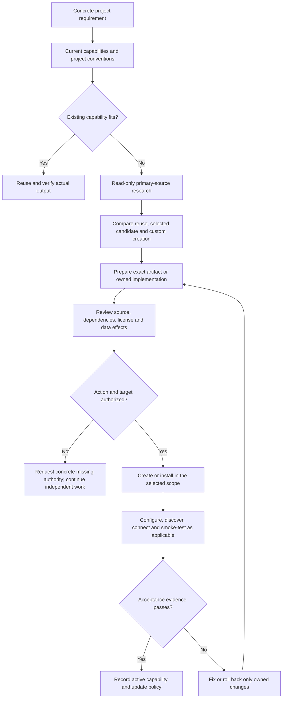

# Project-specific capabilities

The coordinator can research, create and adopt agents, skills and MCP integrations
using the host's available development/install tools. It first checks the user's
existing capabilities. This plugin provides the workflow and optional role profile;
it grants no new tools or permissions and performs no background installations.

The capability_researcher is read-only: it compares public primary sources and returns
facts, unknowns, exact versions/artifacts and validation proposals. Existing owned
workers create agents/skills/MCP code, while reviewers/security/QA inspect and verify.
External web research falls back to primary/default, not the codebase-only explorer.

Use [capability-manager](../skills/capability-manager/SKILL.md) for the full contract.
New roles use supported host profiles and bounded evidence/ownership instructions.
New skills need focused discovery metadata, self-contained workflows and independent
decision scenarios. MCP needs real API/auth/transport, constrained schemas, server-side
access controls and permitted live smoke tests. Generated files are not automatically
loaded or connected. Local stdio launch commands require exact scope/consent because
they execute code on the user's machine; remote services require a separate auth/data
decision. Preserve authorization already supplied for the same action and target.

Track per-project owner, requirement, source/version/commit/artifact hash, license,
privileges, data destinations, scope, dependencies, costs/limits, authority reference,
state, actual evidence and rollback/update plan under docs/capabilities/. Do not store
credential values or private project ledgers globally. Installation, configuration,
discovery, authentication and runtime verification are separate recorded states.

The curated shortlist is in [RESEARCH.md](RESEARCH.md); candidates are not preapproved
dependencies. Third-party adoption needs exact-source review and actual compatibility
checks for the current project. No selected publisher, repository or model is assumed
safe because it is open source, popular or wire-compatible.
