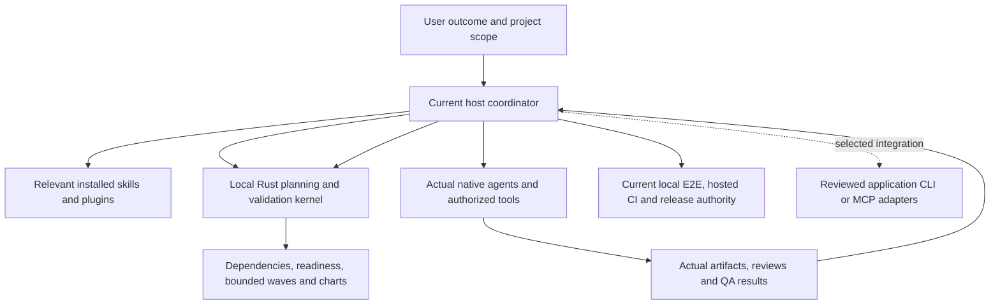

# Product direction and confirmed milestone

AGENT ORCHESTRATOR is a portable plugin for people who already have agents, skills,
plugins or MCP tools. It guides the active host through requirements, decomposition,
owned work, independent inspection, security, actual QA, corrections and release.
The public publisher is NAVANEETH; license Apache-2.0; the local core uses Rust.

The confirmed product outcome is coordinated project work with truthful progress and
evidence, adapting to the user's actual project and capabilities. Installing a plugin
cannot grant local process access, connect external services or create independent
agents where the host exposes none. Host-native controls remain the execution layer.

## Current and next layers

The local kernel validates recorded task graphs and transitions; it proposes a wave
without dispatching it. Inputs declare live capacity, callable capabilities, dependencies,
ownership and evidence. The host authenticates and inspects these facts independently.
Distinct reviewer strings alone do not establish independent identity or review.
No provider account, model, server, listener or telemetry is necessary for this layer.

Acceptance: a real CLI consumer can validate a plan, select a bounded nonconflicting
wave, render a safe chart and cycle through work/review/fix/acceptance. Invalid graphs,
stale revisions, malformed records, failed/skipped required checks, unresolved decisions,
ownership conflicts and stale downstream acceptance are rejected or held. The core
does not execute returned IDs or translate an acceptance label into external authority.

The user selected ChatGPT web plus Codex, including a Rust MCP service, with zero
ongoing hosting budget. Publication is held until the selected product is ready.
The provider-independent next milestone is a local stateless Rust stdio MCP facade.
Remote hosting, data/identity boundaries, optional dashboard, durable storage, RAG
corpus/provider, model calibration and external A2A endpoint remain unresolved.
Research and local implementation can proceed while dependent remote work waits.
See [agent architecture](AGENT-ARCHITECTURE.md), [MCP scope](MCP.md) and the
[live goal-linked ledger](TASK-LIST.md).

## Open-source reuse

Reuse available host-native agents and the skill format. The bounded graph uses Rust
standard collections and an iterative dependency pass; adding a second agent framework
would duplicate the host and introduce new permissions. [petgraph 0.8.3](https://docs.rs/petgraph/0.8.3/petgraph/algo/fn.toposort.html)
is an optional future graph-library candidate (release commit
162903562ce5b00cdba390a0d9c1bb80f1c75bf5, MIT OR Apache-2.0).
The [official Rust MCP SDK](https://github.com/modelcontextprotocol/rust-sdk/tree/0cde3c5cf3e6aff0cc852ce6045f107e95991f48)
is pinned to rmcp 3.5.0 for the selected stateless stdio facade; registry artifact
provenance and license are checked separately from repository examples. Its Windows
debug/release subprocess consumer tests and independent review pass; hosted cross-platform
CI is still pending. CO_OP and CLI-Anything
patterns and exclusions are documented in the source analysis. Fusion is the selected
first app assessment target and already offers official MCP; no connection or real CAD
E2E has occurred. Use open-source designs as references and author our own Rust code;
do not port complete frameworks or copy data merely to change the license.

## Delivery contract

CI validates both Windows and Linux, executes real CLI E2E in the optimized build and
requires all validation, test and E2E jobs to succeed through final-gate. Human review
and current branch protection remain separate. Automatic merge can wait for all actual
required checks/reviews; it must not bypass them. A working plugin package is distinct
from OpenAI directory approval or a hosted business/agent platform.
