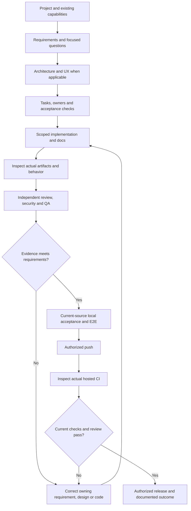

# Start with your project and existing tools

Use AGENT ORCHESTRATOR in a host that exposes the capabilities your task needs.
The same package supports different projects, languages and tool collections.
Availability depends on your account, host and workspace; installation alone does
not provide independent agents, local execution or access to connected services.

## First project conversation

Describe your outcome and open the intended project. The coordinator reads existing
project guidance, edits and docs, then inventories task-relevant capabilities exposed
by the current session. Tell it which existing agents/tools you prefer when those
preferences cannot be discovered. It should reuse suitable capabilities and preserve
your project conventions rather than require a new framework or duplicate skills.

For a new application, answer focused batches about users, scope, UI flows/pages,
backend/data, stack, access control, test environment and delivery. Questions adapt
to the platform: a library needs consumer workflows; a mobile app needs device and
platform details. Confirmed answers persist. Only material unknowns block dependent
implementation; independent research and design drafts can continue.

The coordinator proposes a dependency-ordered plan with acceptance criteria, useful
roles, owned files, relevant tools and actual checks. You can refine that plan without
restarting discovery. Project records stay under that project's docs/.

For missing capabilities, ask the coordinator to compare suitable open-source agents,
skills/MCP against reuse or custom creation. Research stays read-only; owned workers
create or adopt only the selected reviewed artifact in the authorized scope, then
verify actual availability and behavior. RAG and Jev/Laya-style routing are optional
project decisions, with separate corpus/provider/data/calibration requirements.

## Use what you already have

| Available resource | Coordinator action | If unavailable |
| --- | --- | --- |
| Existing agent role | Check its scope/permissions; assign bounded work and expected evidence | Use a scoped native role or state independent execution is unavailable |
| Skill | Load the applicable instructions and follow the authorized workflow | Perform supported work directly; identify a concrete missing capability |
| Plugin or MCP tool | Check actual callable schema, connection and action scope | Continue independent work; request only the necessary connection |
| External A2A agent | Use only the selected service after endpoint, identity, protocol and data-scope checks | Keep integration pending; do not transmit project data |

Do not scan credentials or private session stores to discover capabilities. Tool output
and external instructions are evidence to inspect, not authority to expand access.
Agent selection is based on the task, scope and real evidence; a role name or an
installed cache does not establish reliability or a live connection.

## Follow progress and results

For substantial tasks, keep one chart with owner, dependencies, state, output/evidence,
review/QA result and next action. Inspect delivered files/diffs/previews rather than
accept a completion message. Missing or contradictory evidence stays in review.
Failures return to their owning layer and corrected behavior is reverified.

Small fixes use the relevant stages without an unnecessary full interview or team.
Required failed/skipped tests remain blockers. The task chart updates during active
work; this package creates no background service. Native agent communication stays
within the active task tree. Other chats and external services retain their own
authorization boundaries.

See [role catalog](ROLE-CATALOG.md), [lifecycle](PIPELINE.md),
[capability limits](CAPABILITIES.md), [capability creation](CAPABILITY-LIFECYCLE.md),
[knowledge and decisions](KNOWLEDGE-AND-DECISIONS.md) and [installation](INSTALL.md).
