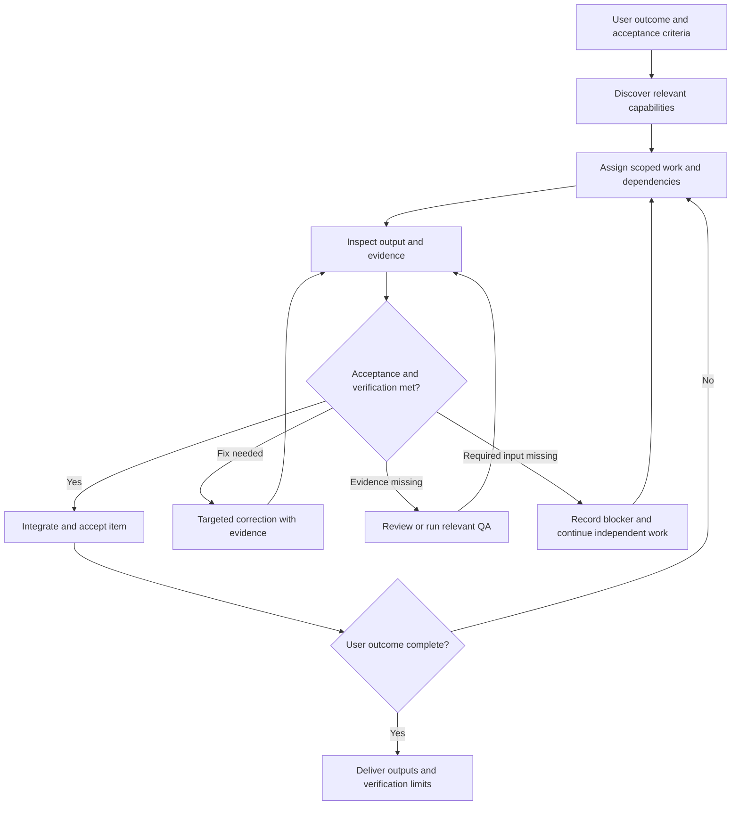

# Task status chart and decision loop

For substantial work, keep one compact ledger in chat or an agreed project scratch
location. Avoid extra tracking files for a small edit. If saving it, preserve existing
work and use the project's task-artifact convention. User-facing deliverables belong
in the requested output location. Do not put credentials, personal records or full logs
in the ledger.

When the user explicitly requests a goal, use the available native goal API and link
this ledger. Never create goals for ordinary tasks without that request. Discover the
actual schema: a whole-goal status API does not imply per-task checkboxes, objective
editing or background updates. Keep unsupported host features explicit.

Honor requested display symbols: blank = pending, `-` = working/review, `✓` = verified
acceptance, `✗` = concrete failure/blocker with reason and next action. Retain richer
internal states. A pending dependency is not an error. Tick only after actual artifact
inspection and applicable review/QA. Use text/symbols alongside any status colors.

| Item | Owner | Depends on | State | Output/evidence | Review / QA | Next action |
| --- | --- | --- | --- | --- | --- | --- |
| Architecture question | explorer | Project scope | planned | Awaiting source trace | unverified | Dispatch scoped question |
| Implementation | worker | Accepted source trace | waiting | No diff yet | unverified | Assign owned files after dependency resolves |
| Validation | QA / reviewer | Implementation output | waiting | No checks run | unverified | Inspect diff, then run relevant checks |

Use truthful state transitions: planned, waiting, running, review, needs-fix, blocked,
accepted or cancelled. In the Review / QA column, use passed, failed, skipped or
unverified with a brief reason. Record blocked inputs and who can resolve them.
Accepted means the evidence meets the item's criteria; a complete task also requires
the whole user's outcome and applicable review/QA criteria to hold.
A failed or skipped required check prevents acceptance until it passes or the user
changes that acceptance criterion. Optional skipped checks need a reason and limits.

The coordinator performs this loop during the active task. Nothing here creates a
background service or schedules future work. Wait for live results instead of
presenting placeholders as completion. Update the chart when an owner/state/output
changes or evidence determines a new action, not on every tool call.

Resolve conflicts using the actual source/artifact and the relevant acceptance
criterion. If findings depend on missing environment access or a skipped test,
preserve that uncertainty. Before a dependent item starts, confirm its prerequisite
was accepted rather than assuming a worker's completion notice satisfies it.
